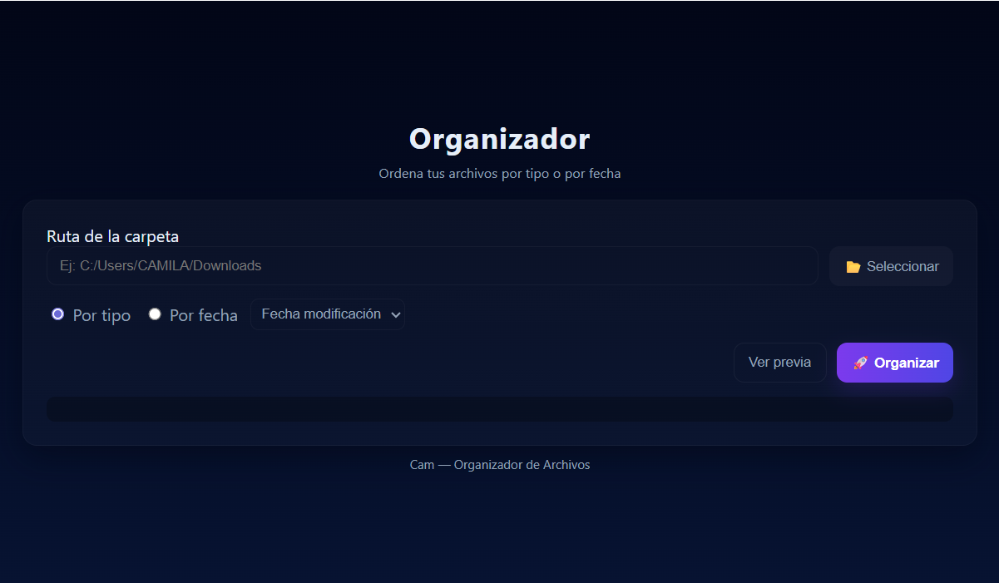

🗂️ Organizador de Archivos

Aplicación de escritorio desarrollada con Electron + Flask (Python) que permite organizar tus archivos según su tipo o fecha de modificación/creación.
Ideal para mantener carpetas ordenadas fácilmente con una interfaz visual.

--------------------------------------------

🚀 Características:

. Organiza archivos por tipo (imágenes, documentos, videos, etc.)

. Organiza archivos por fecha (creación o modificación)

. Vista previa de los archivos que serán movidos

. Interfaz moderna hecha con Electron

. Backend en Flask (Python)

----------------------------------------------- 
⚙️ Instalación

Clona el repositorio:
 
``` bash
git clone https://github.com/Cam-JR/Organizador-de-archivos.git
cd Organizador-de-archivos
```

Instala las dependencias de Node y Python:

``` bash
npm install
pip install -r requirements.txt
```
-------------------------------------------

▶️ Ejecución del proyecto

En una terminal, inicia el backend de Flask:

```bash
python backend/app.py
```
En otra terminal, inicia la aplicación de escritorio:
```bash
npm start
``` 
Esto abrirá automáticamente la ventana de la app de Electron 🎉

--------------------------------------------------------

📸 Vista previa
  
 
